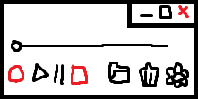
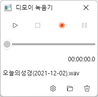

# Win UI 3를 활용한 녹음기 제작 (과제 계획서)

## 1. 교과목명
C++ 프로그래밍

## 2. 지도교수
안동대학교 컴퓨터공학과 심재창 교수님

## 3. 팀명
10팀

## 4. 팀장 및 참여학생 담당업무
|번호|구분|이름|학과|학년|휴대폰|담당업무|
|---|---|---|---|---|---|---|
|1|팀장|우제현|컴퓨터공학과|2학년|010-2935-2337|팀 과제 계획서, 동영상|
|2|팀원|이수용|컴퓨터공학과|2학년|010-3375-1242|논문양식의 보고서, 발표자료 PPT, 리플릿|


담당 업무를 정해놓았지만 팀원끼리 도와가며 했습니다.

## 5. 과제

### 5-1. 과제요약
```
WIN UI 3를 이용해서 녹음기 애플리케이션을 만들어보겠습니다.
관련 오픈소스로는 아래 링크를 참고하였습니다.
```
[참고 문헌 [1]](https://github.com/wjh2335/CPP_Team_Project/blob/main/%EA%B3%84%ED%9A%8D%EC%84%9C.md#6-%EC%B0%B8%EA%B3%A0%EB%AC%B8%ED%97%8C-%EB%B0%8F-%EC%9E%90%EB%A3%8C)  

### 5-2. 과제 개요
```
1. 과제 배경
  WIN UI 3와 관련된 오픈소스에 대해 조사해보던 중 GitHub에서 다른 사람이
  제작한 녹음기 애플리케이션 오픈소스를 발견하였고 난이도가 적절해 보여 해당 주제를 선정하였습니다.
  
2. 과제 필요성
  아직 WIN UI 3 사용이 미숙하기 때문에 간단한 애플리케이션을 제작해보며,
  WIN UI 3에 대해 더욱 더 공부해 볼 수 있습니다.
  
3. 과제 선택 동기
  교수님이 수업 중에 항상 강조하시던 WIN UI 3를 사용해서 애플리케이션을 제작해보고 싶었고,
  미래에 많은 분야에서 쓰이게 될 WIN UI 3를 익혀 앞으로도 여러가지 소프트웨어를 제작하고 싶습니다.
```

### 5-3. 과제 목표 및 내용
#### 1) 정량적/정성적 목표
**1단계)** 기본 틀 : 창닫기, 최소화, 재생, 정지 등 기능은 없더라도 버튼만 구현합니다. (프로토타입)  
**2단계)** 녹음 기능 : 녹음 버튼에 녹음 기능을 추가합니다.  
**3단계)** 재생 기능 : 재생 버튼에 재생 기능을 추가합니다.  
**4단계)** 기타 다른 버튼들에 기능들을 넣어줍니다.  




#### 2) 과제의 내용
Visual Studio 2022를 사용해 WIN UI 3로 다음 사진과 같은 녹음기 제작해 보겠습니다.


  
**▲녹음기 예시**

### 5-4. 결과물
```
1) 예상 결과물
위 사진에서 각 버튼에 기능을 추가한 애플리케이션

ex)
녹음 버튼 -> 녹음
재생 버튼 -> 재생


2) 기대효과 및 활용방안
WIN UI 3에 더욱 익숙해지고 WIN UI 3를 다양하게 활용할 수 있습니다.
또, 녹음기 애플리케이션으로 녹음 & 재생을 할 수도 있습니다.
```

### 5-5. 수행일정
|번호|내용|추진일정|비고|
|---|---|---|---|
|1|팀 과제 계획서|22.05.23 (월)|WINUI3 관련 오픈소스 조사 후 주제 선정|
|2|중간보고서|22.05.29 (일)|녹음기 프로토타입 제작 완료|
|3|리플릿|22.06.05 (일)|-|
|4|발표자료|22.06.05 (일)|-|
|5|논문제작|22.06.09 (목)|-|
|6|유튜브|22.06.11 (토)|-|

## 6. 참고문헌 및 자료
[1] [녹음기 애플리케이션 (GitHub ID : dimohy)](https://github.com/dimohy/DMRecorder)
